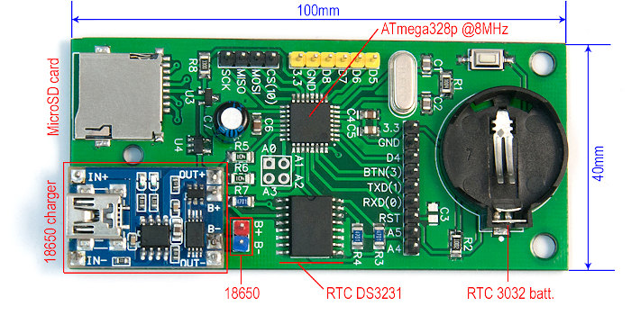
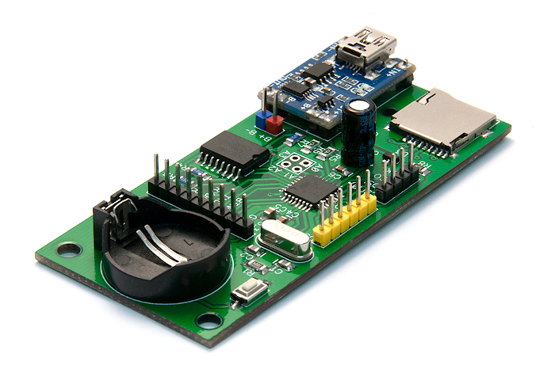
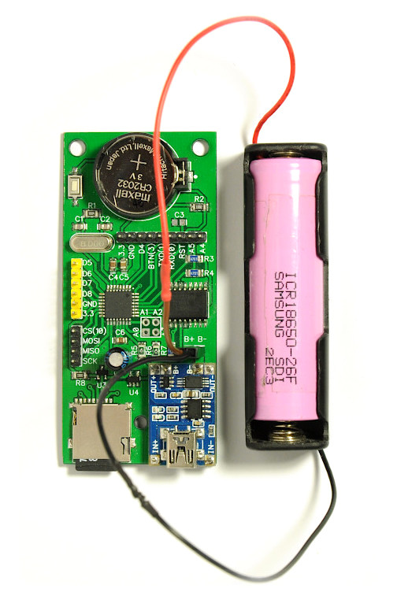

# Event Logger

Energy efficient battery powered logger:

* Built in Real Time Clock with 2032 backup
* uSD card slot + power-off circuit
* 18650 battery charge/protection module.

Measured power consumption:
* 3.3 - 3.5mA in default MCU mode
* 275uA in PWR_DOWN (including ~100uA for DS3231 RTC)

#

